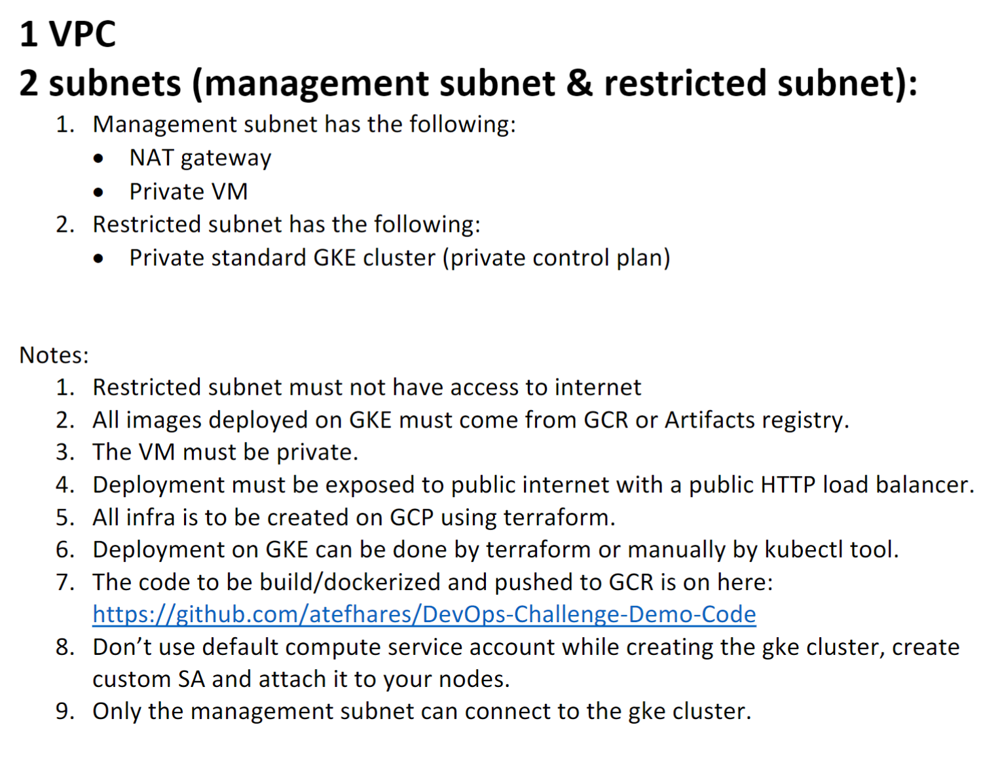

# IaC GKE Using (Terraform And GCP)

## Project Requirement



## Tools:

- gcloud CLI
- Terraform
- Docker

## How to Use:

### Local Steps:

- Clone the repository
- Make sure you have installed gcloud CLI , Terraform and Docker
- Authenticate your user by running
  `gcloud init`
- Navegate to the Application diorectory and build the app using docker by running:
  `docker build -t <repository host>/<project id>/<image name>:<image tag> .`
- Navegate to the Deployment diorectory and make the nessasery change to the deploy-demo-app.yml (The image source)
- Navegate to the Terraform diorectory and initialize it by running
  `terraform init`
- Make the nessasery change in the provider.tf file (project name, region)
- Run `terraform plan` to review the infrastucure
- After reviewing the infrastucure run `terraform apply`

### Cloud Steps:

- run `gcloud compute ssh --zone "<your zone>" "my-instance" --tunnel-through-iap --project "<you project name>"` to ssh into the instance
- install kubectl and gke-gcloud-auth-plugin by running

  ```
  curl -LO "https://dl.k8s.io/release/$(curl -L -s https://dl.k8s.io/release/stable.txt)/bin/linux/amd64/kubectl"
  sudo install -o root -g root -m 0755 kubectl /usr/local/bin/kubectl
  sudo apt-get install google-cloud-sdk-gke-gcloud-auth-plugin
  ```

- After installing the tools on the instance run

  ```
  gcloud container clusters get-credentials my-gke --region <your region> --project <your project name>
  ```

- Copy the content of the Deployment diorectory into the instance
- run `kubectl apply -f deply-demo-app.yml` & `Kubectl apply -f svc-demo-app.yml`
- run `Kubectl get svc` to get the service ip

## Pictures:

### Terraform Apply


### GCP Home


### GCP VPC


### GCP NAT


### GCP IAM


### GCP VMs


### GCP GKE


### GCP Load Balancer


### GCP GCR


### SSH into Instance


### Access the Application


